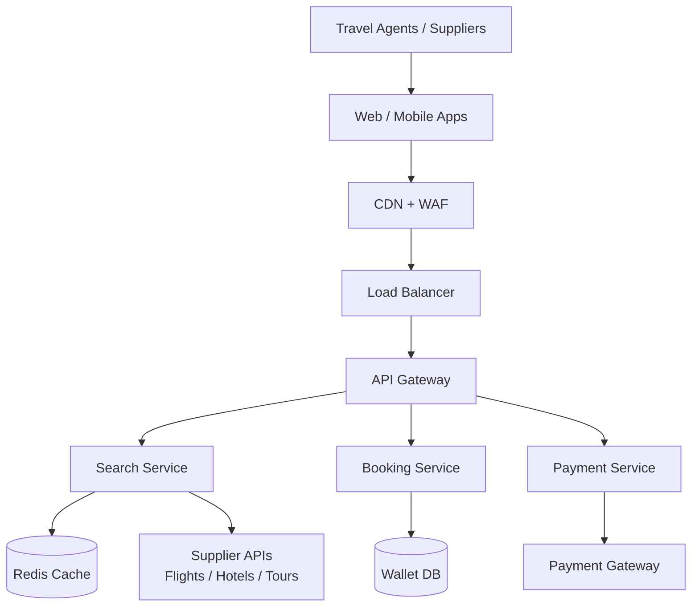
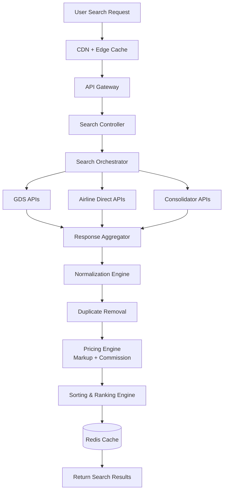
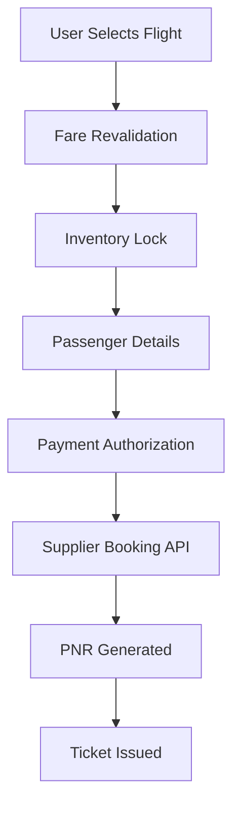
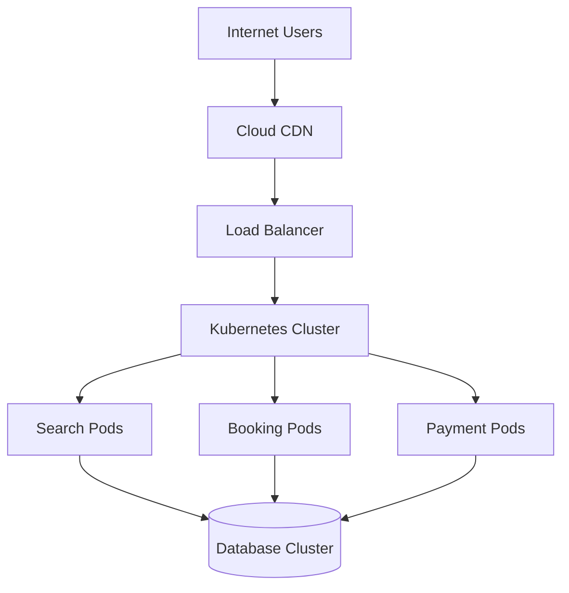

# Fivestartravel-portal

Enterprise-grade B2B travel portal for **flights, hotels, visa, packages, wallet, and payments**.

## Architecture Graphics We Use

This repository uses the same diagram standards followed by enterprise software architecture teams:

- **System Architecture Diagram** (high-level platform)
- **Flight Search Engine Diagram** (supplier aggregation flow)
- **Microservices Architecture Diagram** (service boundaries)
- **Booking Workflow Diagram** (transaction lifecycle)
- **ER Diagram** (data relationships)
- **Cloud Infrastructure Diagram** (deployment and scaling)
- **UI Wireframe** (screen planning)

> Recommended tools: **Lucidchart, Draw.io, Miro, Figma, dbdiagram.io**.

---

## 1) High-Level System Architecture



---

## 2) Flight Search Engine Flow



### Core Search Components

| Component | Function |
|---|---|
| Search Orchestrator | Sends parallel supplier requests |
| Response Aggregator | Combines all supplier responses |
| Normalization Engine | Converts supplier payloads into one schema |
| Duplicate Removal | Removes repeated itineraries |
| Pricing Engine | Applies markup, commission, and rules |
| Ranking Engine | Sorts flights by best-value logic |

---

## 3) Microservices Architecture

```text
travel-platform/
├── gateway/
├── services/
│   ├── auth-service/
│   ├── user-service/
│   ├── agent-service/
│   ├── supplier-service/
│   ├── search-service/
│   ├── pricing-service/
│   ├── booking-service/
│   ├── wallet-service/
│   ├── payment-service/
│   ├── notification-service/
│   └── reporting-service/
├── shared-libraries/
└── infrastructure/
```

### Search Service Example Structure

```text
search-service/
├── controllers/
│   └── flightSearchController.js
├── services/
│   └── supplierSearchService.js
├── repositories/
│   └── searchCacheRepository.js
├── models/
│   └── flightSearchModel.js
└── routes/
    └── searchRoutes.js
```

---

## 4) Booking Engine Workflow



---

## 5) Core Database Schema (Starter Example)

```sql
CREATE TABLE users (
    id BIGINT PRIMARY KEY,
    name VARCHAR(255),
    email VARCHAR(255),
    password_hash TEXT,
    role_id INT,
    status VARCHAR(20),
    created_at TIMESTAMP
);

CREATE TABLE agents (
    id BIGINT PRIMARY KEY,
    user_id BIGINT,
    company_name VARCHAR(255),
    credit_limit DECIMAL(10,2),
    wallet_balance DECIMAL(10,2),
    created_at TIMESTAMP
);

CREATE TABLE flights (
    id BIGINT PRIMARY KEY,
    airline_code VARCHAR(10),
    flight_number VARCHAR(20),
    origin_airport VARCHAR(10),
    destination_airport VARCHAR(10),
    departure_time TIMESTAMP,
    arrival_time TIMESTAMP
);

CREATE TABLE flight_bookings (
    id BIGINT PRIMARY KEY,
    agent_id BIGINT,
    flight_id BIGINT,
    booking_reference VARCHAR(50),
    total_price DECIMAL(10,2),
    booking_status VARCHAR(20),
    created_at TIMESTAMP
);

CREATE TABLE passengers (
    id BIGINT PRIMARY KEY,
    booking_id BIGINT,
    first_name VARCHAR(100),
    last_name VARCHAR(100),
    passport_number VARCHAR(50)
);
```

---

## 6) Cloud Infrastructure Pattern



---

## 7) Technology Stack

| Layer | Recommended Technology |
|---|---|
| Frontend | React / Next.js |
| Backend | Node.js / Java / Laravel |
| Database | PostgreSQL |
| Cache | Redis |
| Queue | Kafka |
| Containers | Docker |
| Orchestration | Kubernetes |

---

## 8) Enterprise Build Phases

1. **Product Planning** — roles, services, and commercial model
2. **System Architecture** — microservices, schema, integrations
3. **Core Platform Development** — auth, dashboards, admin
4. **Booking Engine** — revalidation, lock, payment, issuance
5. **Supplier Integrations** — adapters and normalization
6. **Scalability & Infrastructure** — high-volume cloud deployment

---

## 9) Documentation Standard

Enterprise travel programs typically maintain **40–60 architecture diagrams** across:

- search and booking flows
- API integration maps
- ER diagrams
- cloud and deployment views
- observability and failure recovery flows

This repository now includes a blueprint foundation aligned with those standards.
